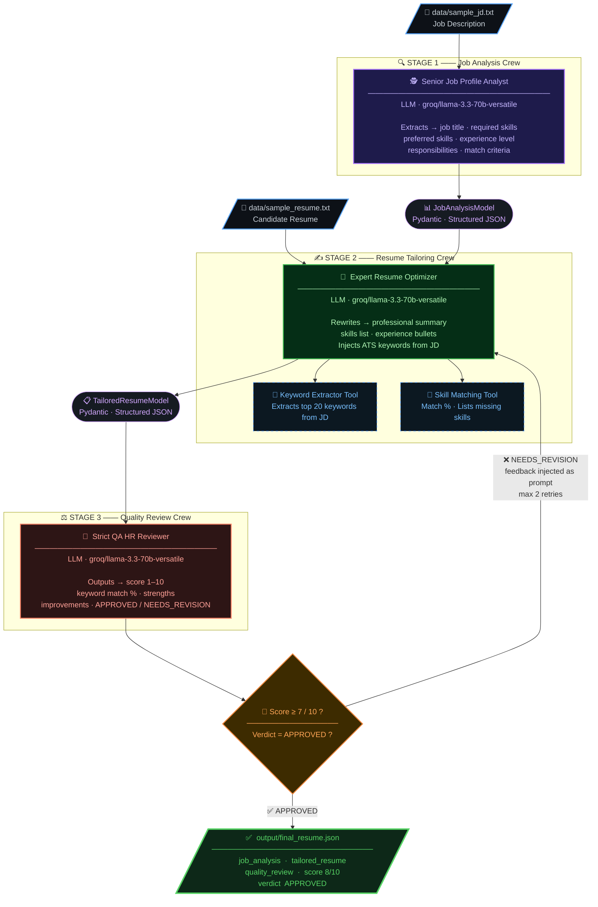

<div align="center">


<br/>

[](https://python.org)
[](https://crewai.com)
[](https://groq.com)
[](https://docs.pydantic.dev)
[](LICENSE)

<br/>

> **An autonomous 3-agent AI pipeline** that reads a Job Description, identifies gaps in your resume, rewrites it to pass ATS systems, and scores it — all automatically.

<br/>

[🚀 Quick Start](#-quick-start) • [🧠 How It Works](#-how-it-works) • [📂 Project Structure](#-project-structure) • [📊 Sample Output](#-sample-output) • [🛠️ Tech Stack](#️-tech-stack)

</div>

---

## ✨ What Is This?

**CrewAI Resume Pipeline** is a production-grade **multi-agent AI system** that solves one of the biggest modern job-hunting problems: your resume doesn't match the job description, so ATS systems reject it before a human ever sees it.

This pipeline **fully automates** the resume tailoring process using three specialized AI agents working in sequence, with an intelligent **feedback loop** that rewrites and re-evaluates the resume until it passes quality standards.

<br/>

## 🧠 How It Works

### Pipeline Architecture



<br/>

### The 3 AI Agents Explained

<table>
  <thead>
    <tr>
      <th>Stage</th>
      <th>Agent Role</th>
      <th>What It Does</th>
      <th>Output Model</th>
    </tr>
  </thead>
  <tbody>
    <tr>
      <td><b>Stage 1</b> 🕵️</td>
      <td>Senior Job Profile Analyst</td>
      <td>Reads raw JD → extracts job title, required skills, preferred skills, responsibilities, experience level, match criteria</td>
      <td><code>JobAnalysisModel</code></td>
    </tr>
    <tr>
      <td><b>Stage 2</b> ✍️</td>
      <td>Expert Resume Optimizer</td>
      <td>Uses Keyword Extractor & Skill Matching tools → rewrites professional summary, updates skills list, enhances experience bullets with JD keywords</td>
      <td><code>TailoredResumeModel</code></td>
    </tr>
    <tr>
      <td><b>Stage 3</b> ⚖️</td>
      <td>Strict QA HR Reviewer</td>
      <td>Scores the tailored resume 1–10, calculates keyword match %, lists strengths & improvements, gives APPROVED or NEEDS_REVISION verdict</td>
      <td><code>QualityReviewModel</code></td>
    </tr>
  </tbody>
</table>

<br/>

### Custom Tools (Stage 2)

| Tool | Purpose |
|---|---|
| `KeywordExtractorTool` | Extracts top 20 important keywords from any text (JD or resume) |
| `SkillMatchingTool` | Compares resume skills vs JD skills → returns match % and missing skills list |

<br/>

## 📂 Project Structure

```
crewai-resume-pipeline/
│
├── 📁 crews/
│   ├── job_analysis.py        # Stage 1 — Job Analyst agent + crew
│   ├── resume_tailoring.py    # Stage 2 — Resume Optimizer agent + crew
│   └── quality_review.py      # Stage 3 — QA Reviewer agent + crew
│
├── 📁 data/
│   ├── sample_jd.txt          # Input: Target job description
│   └── sample_resume.txt      # Input: Candidate's current resume
│
├── 📁 output/
│   └── final_resume.json      # Output: AI-tailored resume + review scores
│
├── main.py                    # Pipeline orchestrator (entry point)
├── models.py                  # Pydantic data models (3 schemas)
├── tools.py                   # Custom CrewAI tools
├── requirements.txt           # Python dependencies
└── .env                       # API keys (not committed)
```

<br/>

## 🚀 Quick Start

### Prerequisites
- Python **3.10+**
- A free [Groq API Key](https://console.groq.com/) (no OpenAI needed!)

### Step 1 — Clone the Repository

```bash
git clone https://github.com/ShreyashPatil530/crewai-resume-pipeline.git
cd crewai-resume-pipeline
```

### Step 2 — Install Dependencies

```bash
pip install -r requirements.txt
```

### Step 3 — Configure API Key

Create a `.env` file in the project root:

```env
GROQ_API_KEY=your_groq_api_key_here
```

> No OpenAI key needed. Memory is disabled by design for speed and cost efficiency.

### Step 4 — Add Your Input Files

```
data/sample_jd.txt       ← Paste the target Job Description here
data/sample_resume.txt   ← Paste your current resume here
```

### Step 5 — Run the Pipeline

```bash
python main.py
```

### Step 6 — View Results

```bash
# Output is saved here:
output/final_resume.json
```

<br/>

## 📊 Sample Output

Below is a real output from the pipeline for a **Senior AI Engineer** role at **TechCorp**:

<details>
<summary><b>📄 Click to expand — Sample Input JD & Resume</b></summary>

**Job Description (input):**
```
Job Title: Senior AI Engineer
Company: TechCorp
Experience Level: 5+ years

Required Skills: Python, LangChain, CrewAI, FastAPI, Docker, REST APIs, Pydantic
Preferred Skills: CI/CD, Vector Databases (Pinecone, Weaviate), AWS/GCP
```

**Original Resume (input):**
```
Jane Doe — Software Developer
Skills: Python, JavaScript, Django, Flask, HTML, CSS, React, Basic ML
Experience: Backend systems with Django, OpenAI API scripts, AWS EC2 deployments
```

</details>

<details open>
<summary><b>✅ Click to expand — Final AI Output (final_resume.json)</b></summary>

```json
{
  "job_analysis": {
    "job_title": "Senior AI Engineer",
    "company_name": "TechCorp",
    "required_skills": ["Python", "LangChain", "CrewAI", "FastAPI", "Docker", "REST APIs", "Pydantic"],
    "preferred_skills": ["CI/CD", "Vector Databases (Pinecone, Weaviate)", "AWS/GCP"],
    "experience_level": "5+ years",
    "match_criteria": "5+ years in AI engineering with Python, LangChain, CrewAI, FastAPI, Docker, REST APIs, Pydantic"
  },

  "tailored_resume": {
    "tailored_summary": "Results-driven Senior AI Engineer with 5+ years designing multi-agent LLM systems using CrewAI and LangChain, building scalable FastAPI services, and managing LLM integrations with OpenAI and Groq.",
    "updated_skills": [
      "Python", "LangChain", "CrewAI", "FastAPI", "Docker",
      "REST APIs", "Pydantic", "CI/CD", "Vector Databases", "AWS/GCP",
      "Multi-agent LLM systems", "LLM integrations", "OpenAI", "Groq"
    ],
    "updated_experience": [
      "Developed multi-agent LLM systems using CrewAI and LangChain with optimized prompt pipelines",
      "Built and deployed scalable REST APIs using FastAPI and Docker on AWS",
      "Collaborated with product teams to gather requirements and design AI-driven backend systems",
      "Created automation scripts using OpenAI API and deployed Flask/React applications"
    ],
    "keywords_added": ["LangChain", "CrewAI", "FastAPI", "Docker", "Pydantic", "CI/CD", "Pinecone", "Weaviate"]
  },

  "quality_review": {
    "score": 8,
    "keyword_match_percentage": 90,
    "strengths": [
      "Strong alignment with multi-agent LLM systems requirement",
      "Proficient in all required skills: Python, LangChain, CrewAI, FastAPI, Docker, REST APIs, Pydantic",
      "Good collaboration and product experience demonstrated"
    ],
    "improvements": [
      "Add specific metrics (e.g., latency improvements, throughput numbers)",
      "Include relevant AI certifications or open-source contributions",
      "Provide more context on CI/CD and Vector Database experience"
    ],
    "verdict": "APPROVED"
  }
}
```

</details>

### Pipeline Terminal Output

```
=======================================
 Starting Job Application AI Pipeline
=======================================

-> Running Job Analysis Crew...
   [Success] Extracted Job Title: Senior AI Engineer

--- Attempt 1 of 3 ---
-> Running Resume Tailoring Crew...
   [Success] Resume Tailored.

-> Running Quality Review Crew...
   [Score]: 8/10
   [Verdict]: APPROVED

✅ Resume met quality standards!

=======================================
 Pipeline Complete!
 Final resume saved to: output/final_resume.json
=======================================
```

<br/>

## 🛠️ Tech Stack

<div align="center">

| Technology | Purpose | Version |
|:---:|:---:|:---:|
|  | Core language | 3.10+ |
|  | Multi-agent orchestration framework | Latest |
|  | LLM inference (ultra-fast) | 70B Versatile |
|  | Structured output validation | v2 |
|  | Environment config management | Latest |

</div>

<br/>

## 🔄 Feedback Loop Logic

```python
max_retries = 2
while attempt <= max_retries:
    tailored_resume = run_resume_tailoring(jd_model, resume_text, feedback)
    review = run_quality_review(tailored_resume, jd_model)
    
    if review.score >= 7 and review.verdict == "APPROVED":
        break  # ✅ Quality bar met
    else:
        feedback = "; ".join(review.improvements)  # 🔁 Send feedback to Stage 2
        attempt += 1
```

The QA Reviewer's feedback is injected back into Stage 2 as a **CRITICAL FEEDBACK** instruction, forcing the Resume Optimizer to address specific gaps on the next attempt.

<br/>

## 📈 Future Enhancements

- [ ] **PDF Parsing** — Accept `.pdf` resumes as input (PyPDF2 / pdfplumber)
- [ ] **Streamlit UI** — Web interface to upload JD and resume, view results visually
- [ ] **DOCX Export** — Auto-generate a formatted Word document from the final output
- [ ] **Multi-JD Mode** — Batch process multiple job descriptions at once
- [ ] **Vector DB Memory** — Store and retrieve past resume analyses using Pinecone

<br/>

## 🤝 Contributing

Contributions are welcome! Feel free to open an issue or submit a pull request.

1. Fork the repository
2. Create your feature branch (`git checkout -b feature/amazing-feature`)
3. Commit your changes (`git commit -m 'Add amazing feature'`)
4. Push to the branch (`git push origin feature/amazing-feature`)
5. Open a Pull Request

<br/>

---

<div align="center">

**Built with ❤️ using [CrewAI](https://crewai.com) & [Groq](https://groq.com)**

⭐ If this project helped you, please give it a star!

[](https://github.com/ShreyashPatil530/crewai-resume-pipeline)

<br/>

---

### 👨‍💻 Author


[](https://shreyash-orpin.vercel.app/)
[](https://github.com/ShreyashPatil530)

</div>
