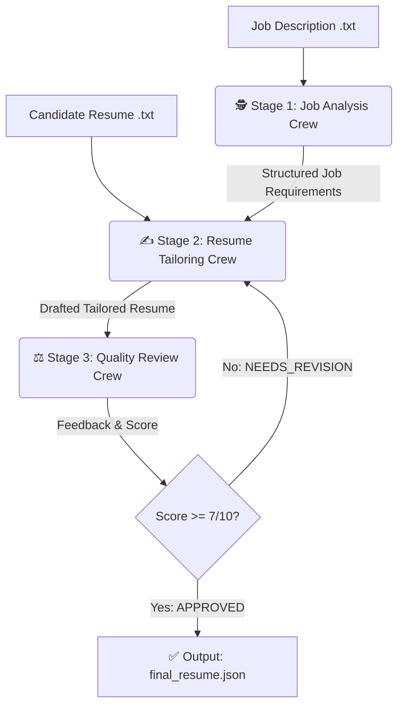

<div align="center">
  <h1>🚀 Auto-Tailor AI: Multi-Agent Resume Optimizer</h1>
  <p><i>An autonomous CrewAI pipeline that dynamically analyzes job descriptions, tailors resumes, and evaluates application readiness using LLMs.</i></p>
  
  [](https://www.python.org/downloads/)
  [](https://crewai.com/)
  [](https://groq.com/)
  [](https://docs.pydantic.dev/)
</div>

---

## 📖 Overview

**Auto-Tailor AI** is a production-ready multi-agent artificial intelligence pipeline built with **CrewAI**. It aims to solve the modern job hunt dilemma by automatically reading a target Job Description (JD), identifying missing keywords in your resume, intelligently rewriting your resume to highlight the right skills, and performing a strict HR quality review to ensure your application passes ATS (Applicant Tracking Systems).

The entire system runs on the **Groq API** (using `llama-3.3-70b-versatile`) for blazing-fast inference, bypassing the need for expensive OpenAI embeddings.

---

## 🧠 Multi-Agent Architecture Workflow

This pipeline utilizes a 3-stage iterative feedback loop:



1. **🕵️ Senior Job Profile Analyst (Stage 1)**
   - Extracts exact required skills, preferred skills, and core responsibilities from the raw JD into a strict Pydantic JSON schema.
2. **✍️ Expert Resume Optimizer (Stage 2)**
   - Uses custom tools (`Keyword Extractor`, `Skill Matching`) to identify gaps.
   - Rewrites the professional summary and experience bullet points to directly align with the JD requirements.
3. **⚖️ Strict QA HR Reviewer (Stage 3)**
   - Critiques the generated resume against the original JD.
   - Outputs a score (1-10) and a verdict. If the resume fails (`< 7`), it is sent back to Stage 2 for a rewrite (up to 3 attempts).

---

## 🛠️ Tech Stack
- **Framework:** [CrewAI](https://github.com/joaomdmoura/crewAI)
- **Language Models:** Groq (`llama-3.3-70b-versatile`)
- **Data Validation:** Pydantic (Strict structured JSON outputs)
- **Environment Management:** `python-dotenv`

---

## 🚀 Quick Start Guide

### 1. Clone the Repository
```bash
git clone https://github.com/ShreyashPatil530/multi-agent-resume-optimizer.git
cd multi-agent-resume-optimizer
```

### 2. Install Dependencies
Ensure you have Python 3.10+ installed.
```bash
pip install -r requirements.txt
```

### 3. Setup Environment Variables
Create a `.env` file in the root directory and add your Groq API key:
```env
GROQ_API_KEY=your_groq_api_key_here
```
*(No OpenAI key is required, embedding memory is disabled by design).*

### 4. Provide Input Data
Place your raw files in the `data/` folder:
- `data/sample_jd.txt`: Paste the target Job Description.
- `data/sample_resume.txt`: Paste your current raw resume.

### 5. Run the AI Pipeline
Execute the main orchestrator script:
```bash
python main.py
```

### 6. View Results
Once the pipeline successfully clears the HR Reviewer's quality check, the optimized resume will be saved in the `output/` directory:
```bash
cat output/final_resume.json
```

---

## 💡 Future Enhancements
- [ ] Add PDF parsing capabilities (PyPDF2 / PDFMiner).
- [ ] Integrate a Streamlit or Gradio front-end UI.
- [ ] Implement an automatic Word Document (`.docx`) exporter for the final result.

---
<div align="center">
  <i>Built with ❤️ using CrewAI & Groq</i>
</div>
